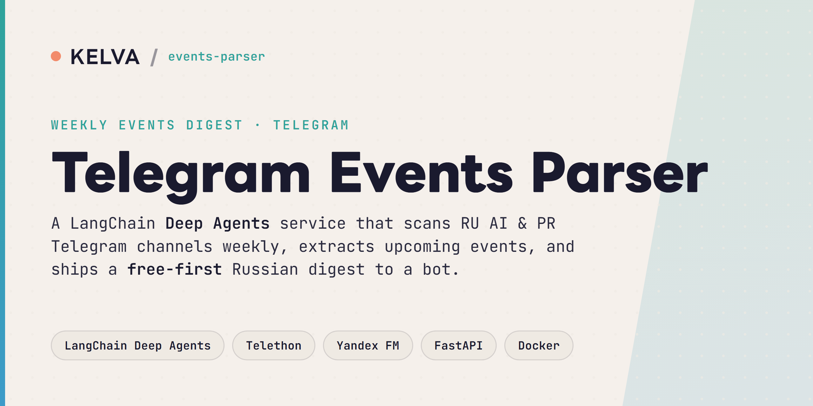

# Kelva Telegram Events Parser



[](https://www.python.org/)
[](https://github.com/langchain-ai/deepagents)
[](https://yandex.cloud/en/services/foundation-models)
[](https://docs.telethon.dev/)
[](./Dockerfile)
[](./tests)
[](#license)

Weekly Russian-language digest of upcoming **AI** and **PR** industry events
(conferences · meetups · webinars · forums · workshops) scanned from RU Telegram
channels, **free events prioritized**, deduplicated, and delivered via a dedicated
Telegram bot.

Built on the **LangChain Deep Agents** framework (a supervisor delegating to
`ai-events` / `pr-events` subagents), inference on **Yandex Foundation Models**,
packaged for **Docker**, observability-ready for **LangSmith**.

---

## How it works

```
                weekly cron (Mon 09:00)  ┐
                /digest bot command      ┘──▶ DigestRunner
                                               │
        ┌──────────────────────────────────────┴───────────────────────────┐
        │  Deep Agents supervisor                                            │
        │    ├─ ai-events subagent  ── scans AI channels   ─┐                │
        │    └─ pr-events subagent  ── scans PR channels   ─┤  tool          │
        │                                                    ▼  side-effects  │
        │   fetch (Telethon / t.me preview) → Yandex extract → EventCollector│
        └──────────────────────────────────────┬───────────────────────────┘
                                                ▼
            finish_digest:  dedup (SQLite) → rank (free‹paid‹unknown, by date)
                            → render (RU, HTML) → deliver (Telegram bot)
```

Correctness flows through **deterministic tool side-effects** into a typed
collector, not through parsing the LLM's free-text — so the model orchestrates
*which* channels get scanned, while the digest content stays deterministic and
fully unit-tested.

## Features

- **Two-domain coverage** — AI-field and PR-field events, each owned by its own subagent.
- **Free-first ranking** — free events surface above paid; an "open / on-request" section catches dateless announcements.
- **Account-based reading** — Telethon (MTProto) session for full history, media, and preview-disabled channels, with a zero-auth `t.me/s/{channel}` fallback.
- **Cross-week dedup** — SQLite seen-store keyed by a stable event hash (normalized title + date + host).
- **Russian output** — `«…»` quotes, em-dashes, RU month names, free/paid badges, HTML-escaped links.
- **Hybrid triggers** — weekly APScheduler cron (`0 9 * * 1`) + on-demand `/digest`.

## Quick start

```bash
cp .env.example .env          # fill in bot token, Yandex key/folder, (optional) Telethon session
cp channels.yaml.example channels.yaml   # or use the bundled list

# one-shot digest (real send)
uv run --extra runtime python -m events_parser --live
uv run --extra runtime python -m events_parser --live --dry-run   # preview, no send
uv run --extra runtime python -m events_parser --live --no-agents # deterministic path

# long-running host (weekly cron + /digest bot)
docker compose up -d          # → http://localhost:8080/health
```

## Configuration

All configuration is via environment variables — see [`.env.example`](.env.example). Key ones:

| Variable | Purpose |
|---|---|
| `TELEGRAM_BOT_TOKEN` / `TELEGRAM_TARGET_CHAT_ID` | Delivery bot + recipient chat |
| `TELEGRAM_API_ID` / `TELEGRAM_API_HASH` / `TELEGRAM_SESSION` | Telethon account read (optional; falls back to `t.me/s` preview) |
| `YANDEX_API_KEY` / `YANDEX_FOLDER_ID` | Yandex Foundation Models auth |
| `CHANNELS_CONFIG` | Path to the channel list (`channels.yaml`) |
| `HORIZON_DAYS` / `SCAN_DAYS` | Look-ahead window (default 28) / scan-back window (default 7) |
| `USE_AGENTS` | `true` → Deep Agents supervisor; `false` → deterministic pipeline |

Telethon sessions can be minted from a Telegram Desktop `tdata` folder with
[`scripts/tdata_to_session.py`](scripts/tdata_to_session.py).

## Development

```bash
uv run --extra dev pytest        # 55 unit tests — no network / LLM / Telegram
```

The architecture is built around injectable seams (`Fetch`, `Extractor`,
`SeenStore`, `Notifier` protocols) so the whole pipeline is testable with fakes.
See [`docs/PRD.md`](docs/PRD.md) for the product spec and [`docs/issues/`](docs/issues)
for the vertical-slice build backlog.

## Tech stack

Python 3.12 · LangChain Deep Agents · Telethon (MTProto) · Yandex Foundation
Models (`yandexgpt-lite` + `qwen3-235b`) · FastAPI · APScheduler · SQLite ·
pydantic v2 · httpx · selectolax · Docker.

## License

Proprietary — © Kelva Tech. Internal product; not for redistribution.
